# App Screenshots

A visual overview of the application's interface for both user and admin roles.

---

Jump to:
- [Greet](#-greet-screen)
- [Register](#-register-screen)
- [Login](#-login-screen)
- [Home](#-home-screen)
- [Subjects](#-subjects-screen)
- [Assignments](#-assignments-screen)
- [Kas](#-kas-screen)
- [Piket](#-piket-screen)

---

## 📱 Greet Screen  

---

## 📝 Register Screen  
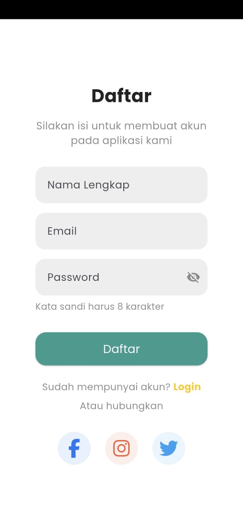

---

## 🔐 Login Screen  
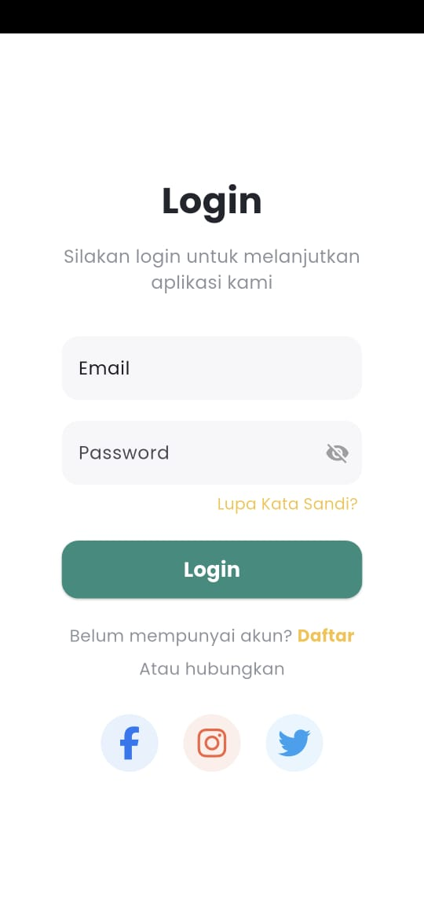

---

## 🏠 Home Screen  
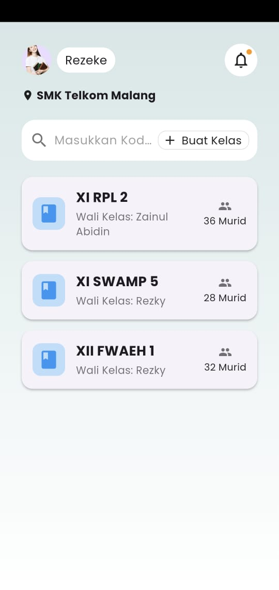

---

## 📚 Subjects Screen  

### User View  
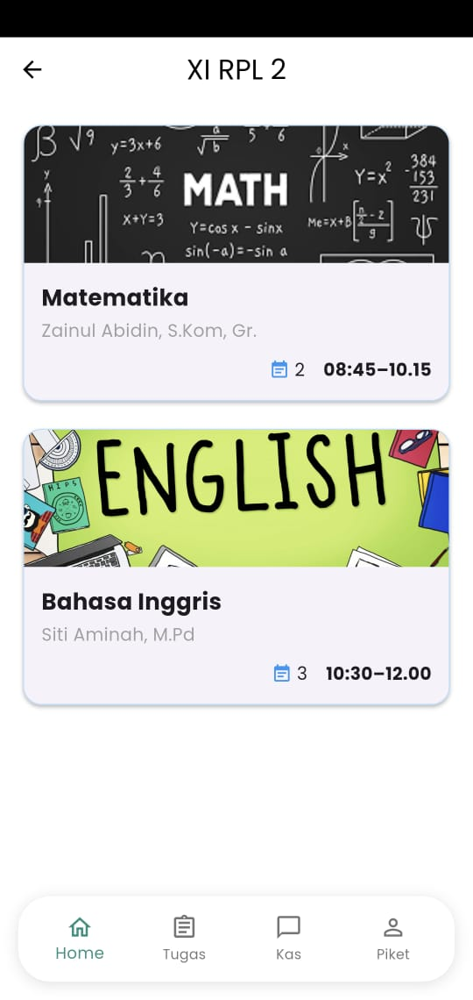

### Admin View  
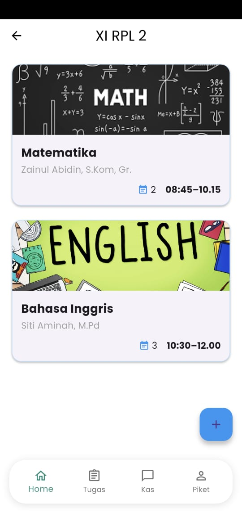
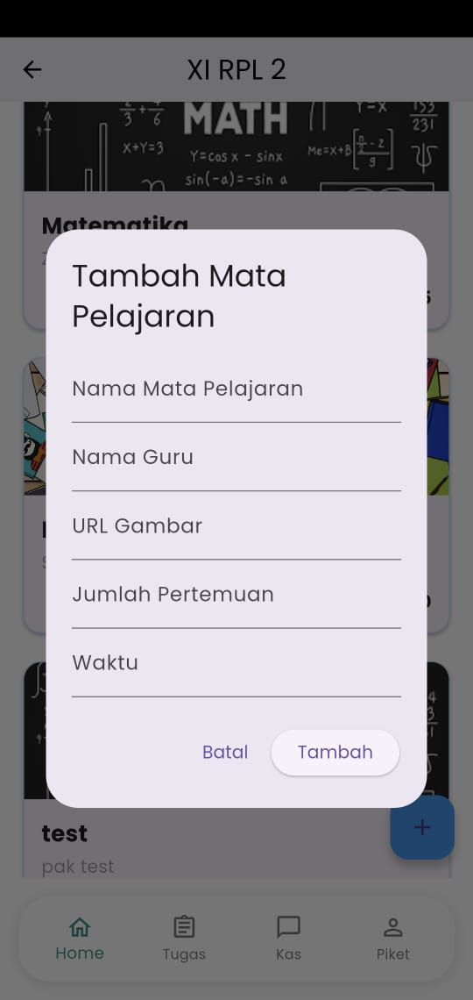

---

## 📝 Assignments Screen  

### User View  
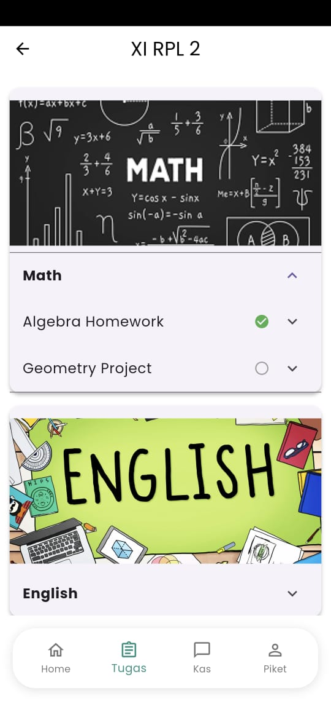

### Admin View  
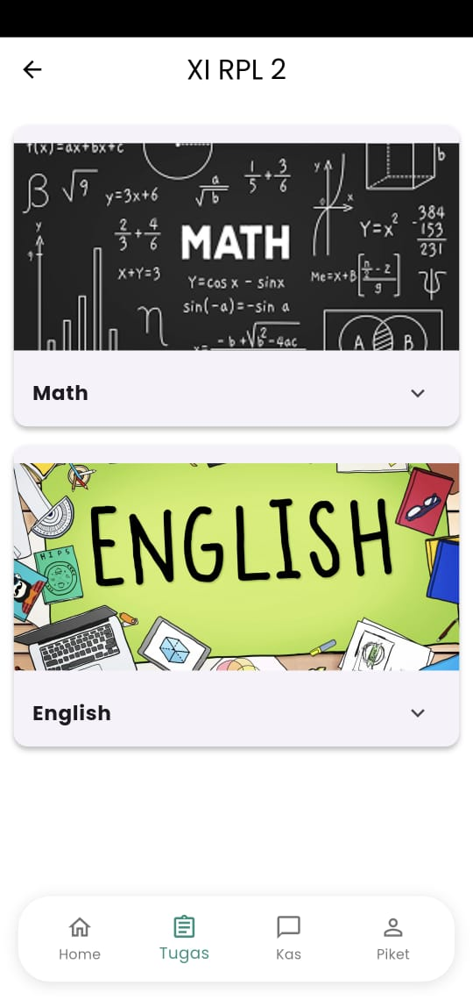
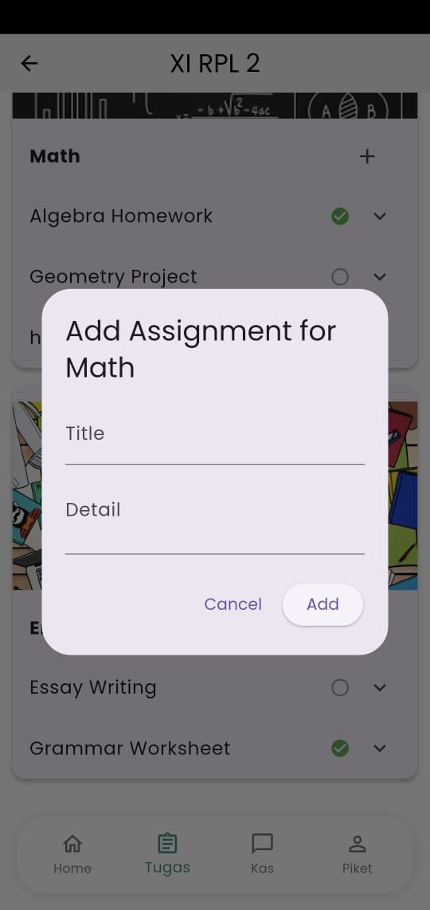

---

## 💰 Kas Screen  

### User View  
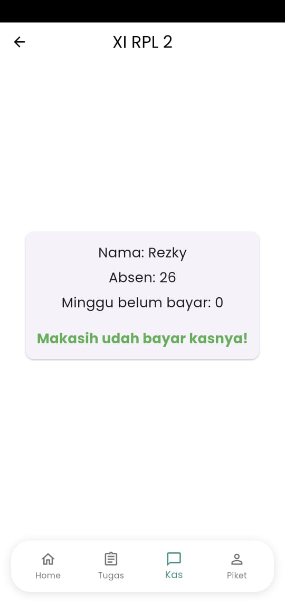

### Admin View  
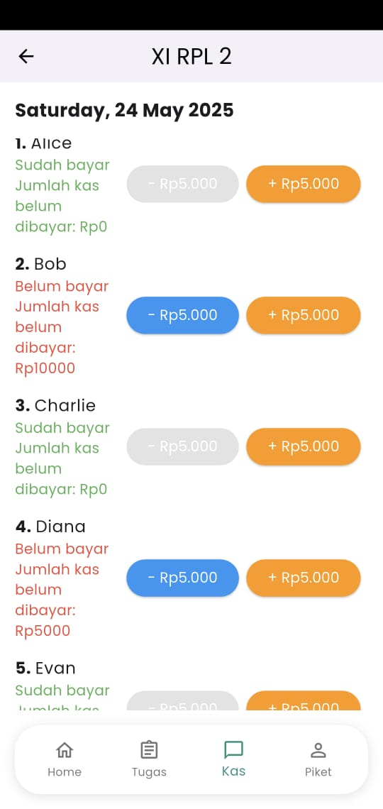

---

## 🧹 Piket Screen  

### User View  
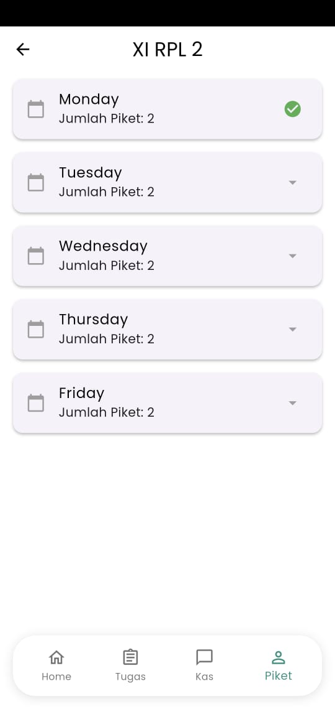

### Admin View  
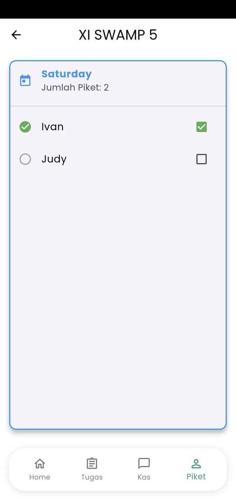

